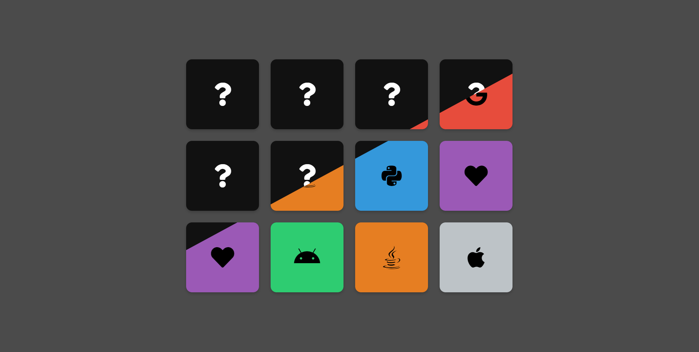

# Memory Game

Get ready to challenge your brain, because you need to use some memory power!
Joking aside...
This is a small Memory Game written in plain JavaScript and CSS.
The icons come from 'Font Awesome', thanks...
The thing to do is very simple: match two cards that are the same.

No installation is required, just open the 'index.html' file in the project folder in the web browser of your choice.
So what happens when the game is over? Nothing, seriously nothing.
So what do I do? Play it again then.
